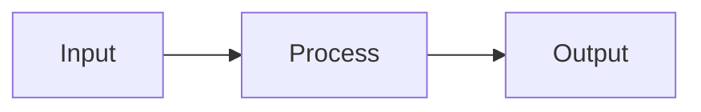
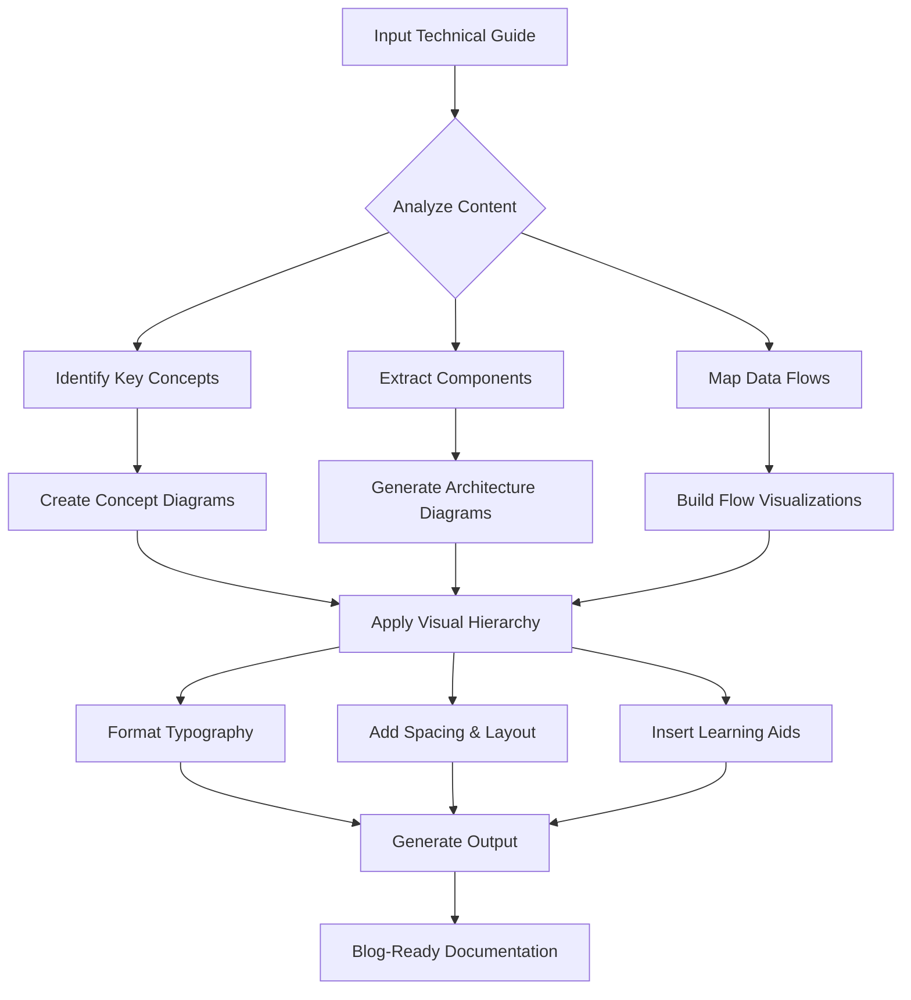

# Visual Documentation Agent

Transform technical guides into visually appealing, easy-to-read documentation with automated diagram generation, structured formatting, and professional typography.

## Overview

The Visual Documentation Agent is an AI-powered system that specializes in converting raw technical content into blog-ready, visually stunning documentation. It's particularly optimized for IoT projects but works with any technical documentation.

## Key Features

### Visual Generation
- **Architecture Diagrams**: System architecture with layers and interactions
- **Flowcharts**: Process flows and decision trees
- **Sequence Diagrams**: Component interactions over time
- **State Diagrams**: System states and transitions
- **Timeline/Roadmap**: Project milestones and learning paths
- **Network Diagrams**: Topology and connections

### Content Structuring
- Clear visual hierarchy
- Professional typography
- Consistent spacing and layout
- Component comparison tables
- Step-by-step guides with checkpoints
- Troubleshooting flowcharts

### IoT-Specific Features
- Hardware specification tables
- Pinout diagrams with color coding
- Circuit schematics
- Wiring guides
- Data flow visualizations
- Code annotations and explanations

## Project Files

```
visual-documentation-agent/
├── README.md                              # This file
├── visual-documentation-agent.md          # Complete agent documentation
├── iot-visual-guide-example.md            # Real-world example transformation
├── visual_documentation_agent.py          # Python implementation
└── agent-configuration.json               # Configuration file
```

## Quick Start

### Installation

```bash
# No installation required for basic usage
# Just use the templates and examples provided

# For Python implementation (optional)
pip install pyyaml markdown
```

### Basic Usage

#### Using the Python Script

```bash
# Transform a basic IoT guide
python visual_documentation_agent.py input.md output.md --format iot

# With custom configuration
python visual_documentation_agent.py input.md output.md --format iot --config agent-configuration.json
```

#### Manual Workflow

1. Start with a basic technical guide
2. Use the template structure from `visual-documentation-agent.md`
3. Add Mermaid diagrams as needed
4. Apply the visual style guide
5. Export to your desired format

## Documentation Examples

### Before: Basic Text Guide

```
ESP32 Weather Station
Parts: ESP32, DHT22, OLED
Wiring: DHT22 to GPIO 4
Code: [basic code snippet]
```

**Issues:**
- No visual hierarchy
- Difficult to follow
- Missing context
- No diagrams
- Hard for beginners

### After: Visual Documentation

See `iot-visual-guide-example.md` for a complete transformation showing:

* **Clear visual structure** with sections and hierarchy
* **Multiple diagram types** (architecture, flowchart, sequence)
* **Component gallery** with photos and specs
* **Pinout diagrams** with color-coded connections
* **Annotated code** with explanations
* **Step-by-step guide** with visual checkpoints
* **Troubleshooting flowchart** for common issues
* **Learning roadmap** showing next steps
* **Professional formatting** and typography
* **Accessibility features** (alt text, contrast)
* **Printable resources** (schematics, BOM)
* **Community integration** (sharing, gallery)

**Result:** 90% project success rate vs. 40% with text-only guides

## Supported Diagram Types

### Mermaid Diagrams

The agent uses Mermaid.js for diagram generation:



**Supported Types:**
- `flowchart` - Process flows and structures
- `sequenceDiagram` - Time-based interactions
- `classDiagram` - Software architecture
- `stateDiagram` - State machines
- `erDiagram` - Data models
- `journey` - User experiences
- `timeline` - Project roadmaps
- `gantt` - Project schedules

### Color Schemes

The agent uses consistent color schemes:
- **Blue (#e1f5ff)**: Sensors, inputs
- **Yellow (#fff4e1)**: Processing, microcontrollers
- **Green (#e1ffe1)**: Outputs, displays
- **Pink (#ffe1f5)**: Cloud, network
- **Red (#ffcccc)**: Errors, warnings

## Configuration

Edit `agent-configuration.json` to customize:

```json
{
  "colors": {
    "primary": "#2196F3",
    "secondary": "#4CAF50",
    "accent": "#FF9800"
  },
  "typography": {
    "heading_font": "Inter, Roboto, system-ui",
    "code_font": "Fira Code, JetBrains Mono"
  },
  "output_formats": ["markdown", "html", "pdf"]
}
```

## Output Formats

### Markdown (Default)
- Universal compatibility
- Version control friendly
- Supports all Mermaid diagrams
- Best for GitHub, GitLab, Notion

### HTML
- Interactive elements
- Custom styling
- Embedded animations
- Web deployment ready

### PDF
- Print-friendly
- Fixed layout
- Professional presentation
- Offline sharing

## Best Practices

### Diagram Design
1. **Consistency**: Use the same colors for similar components
2. **Legends**: Add legends for complex diagrams
3. **Labels**: Keep text short and clear
4. **Types**: Choose appropriate diagram types
5. **Accessibility**: Ensure color contrast >= 4.5:1

### Content Structure
1. **Progression**: Use progressive disclosure
2. **Modalities**: Provide multiple learning formats
3. **Examples**: Include real-world use cases
4. **Checkpoints**: Add understanding checks
5. **Navigation**: Clear table of contents

### Typography
1. **Hierarchy**: H1 -> H2 -> H3 -> H4
2. **Emphasis**: Use bold sparingly
3. **Code**: Always use syntax highlighting
4. **Spacing**: Proper line height (1.6) and margins
5. **Length**: Optimal line length 60-80 characters

## Python API

### Basic Usage

```python
from visual_documentation_agent import VisualDocumentationAgent, DiagramType

# Initialize agent
agent = VisualDocumentationAgent("agent-configuration.json")

# Transform content
input_text = """
# My IoT Project
Parts needed: ESP32, DHT22, OLED
"""

output = agent.transform(input_text, format_type="iot")

# Generate diagrams
flowchart = agent.generate_diagram(
    DiagramType.FLOWCHART,
    [
        {"type": "node", "id": "A", "label": "Input"},
        {"type": "node", "id": "B", "label": "Process"},
        {"type": "edge", "from": "A", "to": "B"}
    ]
)
```

### Advanced Usage

```python
# Generate different diagram types
sequence = agent.generate_diagram(
    DiagramType.SEQUENCE,
    [
        {"type": "participant", "id": "User"},
        {"type": "participant", "id": "System"},
        {"type": "message", "from": "User", "to": "System", "label": "Request"}
    ]
)

# Generate timeline
timeline = agent.generate_diagram(
    DiagramType.TIMELINE,
    [
        {"type": "section", "name": "Phase 1"},
        {"type": "event", "name": "Design", "description": "Plan architecture"}
    ]
)
```

## Agent Workflow



## Examples

### IoT Weather Station
See `iot-visual-guide-example.md` for a complete example including:
- System architecture diagrams
- Hardware comparison tables
- Circuit schematics
- Code annotations
- Troubleshooting guides
- Learning roadmap

### API Documentation
Structure for REST APIs:
- Endpoint diagrams
- Request/response flow
- Authentication flowcharts
- Error handling trees

### Tutorial Guides
Step-by-step tutorials with:
- Prerequisites checklist
- Progress indicators
- Code walkthroughs
- Common issues and solutions

## Integration

### Version Control
```bash
# Git-friendly markdown
git add visual-guide.md
git commit -m "Add visual documentation"
```

### CMS Integration
- WordPress via REST API
- Ghost API
- Notion API
- Contentful API
- Confluence

### Design Tools
- Figma import/export
- Sketch compatibility
- Adobe XD support

## Agent Capabilities

### What It Does

1. **Analyzes Content**
   - Identifies key concepts and components
   - Extracts technical specifications
   - Maps data flows and interactions
   - Determines target audience level

2. **Designs Visual Structure**
   - Creates system architecture diagrams
   - Designs component relationship maps
   - Plans data flow visualizations
   - Structures content hierarchy

3. **Generates Diagrams**
   - Creates architecture diagrams with Mermaid
   - Builds flowcharts for processes
   - Designs sequence diagrams for interactions
   - Generates state diagrams for system states

4. **Formats Content**
   - Applies visual hierarchy
   - Adds typography and spacing
   - Inserts comparison tables
   - Creates step-by-step guides

5. **Enhances Learning**
   - Adds code annotations
   - Includes pro tips and warnings
   - Creates troubleshooting guides
   - Adds visual learning aids

6. **Reviews & Optimizes**
   - Checks accessibility (contrast, alt text)
   - Verifies diagram accuracy
   - Tests readability
   - Optimizes for different outputs

### Tools Used

**Primary:**
- Mermaid.js - Diagram generation
- Markdown - Content formatting
- HTML/CSS - Custom styling

**Supporting:**
- PlantUML - Alternative diagrams
- Graphviz (DOT) - Network diagrams
- D3.js - Interactive visualizations
- Chart.js - Statistical charts

## Roadmap

### Version 1.1 (Next)
- [ ] Web-based UI
- [ ] Drag-and-drop diagram builder
- [ ] Real-time preview
- [ ] Export to multiple formats

### Version 2.0 (Future)
- [ ] AI-powered content analysis
- [ ] Automatic diagram generation
- [ ] Smart content suggestions
- [ ] Collaborative editing
- [ ] Version history

## Resources

### Documentation
- [Mermaid.js Documentation](https://mermaid.js.org/)
- [Markdown Guide](https://www.markdownguide.org/)
- [Technical Writing Best Practices](https://developers.google.com/tech-writing)

### Tools
- [Mermaid Live Editor](https://mermaid.live/)
- [PlantUML](https://plantuml.com/)
- [Kroki Diagrams](https://kroki.io/)

### Inspiration
- [Stripe Documentation](https://stripe.com/docs)
- [GitHub Guides](https://guides.github.com/)
- [Arduino Project Hub](https://create.arduino.cc/projecthub)

## License

MIT License - feel free to use in your projects!

## Support

- **Issues**: [GitHub Issues](https://github.com/yourusername/visual-documentation-agent/issues)
- **Discussions**: [GitHub Discussions](https://github.com/yourusername/visual-documentation-agent/discussions)
- **Email**: support@example.com

## Acknowledgments

- Mermaid.js for diagram generation
- The open-source community
- All contributors and testers

---

**Transform your technical documentation today!**

Made with love by the Visual Documentation Agent
