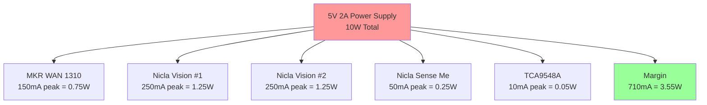
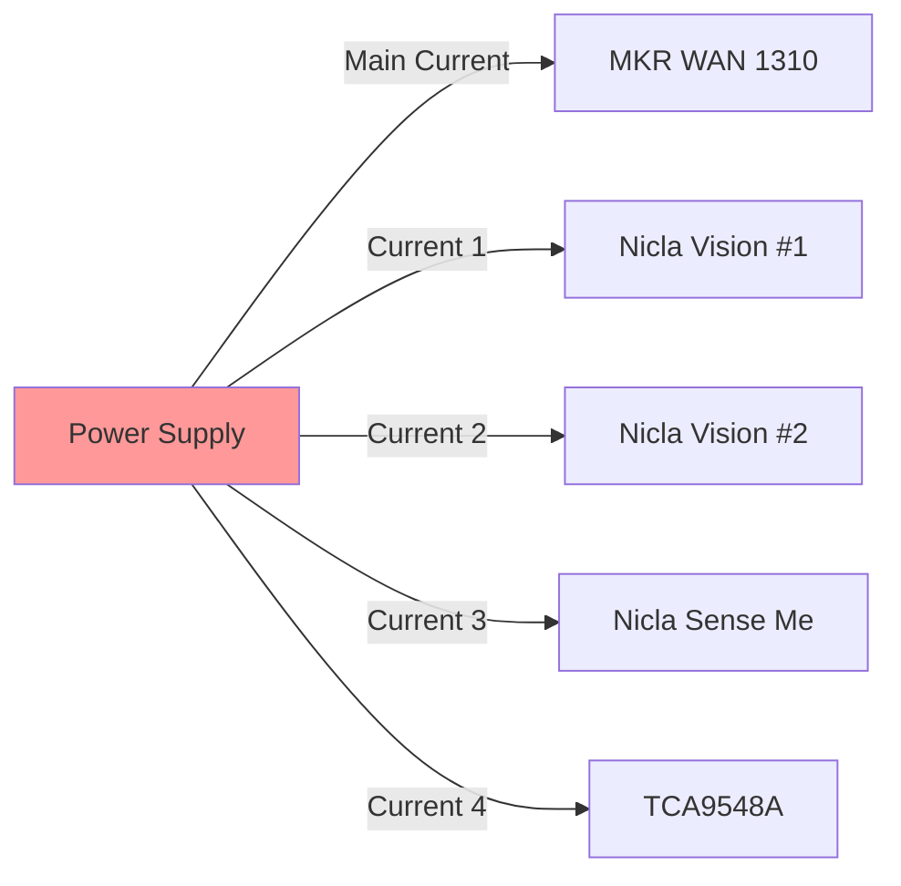

# Power Budget Analysis - IoT Multi-Sensor System

## Executive Summary

This document provides a comprehensive power budget analysis for the IoT multi-sensor system. The system requires a **5V 2A power supply** to ensure reliable operation under all conditions with adequate safety margin.

## Total Power Requirements

| Operating Mode | Total Current | Power (5V) | Safety Margin |
|----------------|---------------|------------|---------------|
| Idle | 50mA | 0.25W | 40x |
| Normal Operation | 355mA | 1.78W | 5.6x |
| Peak (All Active) | 710mA | 3.55W | 2.8x |
| With Transmissions | 910mA | 4.55W | 2.2x |

**Recommendation**: 5V 2A power supply provides 2.2x safety margin even during peak transmission scenarios.

## Component Power Analysis

### 1. Arduino MKR WAN 1310 (Central Hub)

```
Operating States:
- Deep Sleep: 2.5mA @ 3.3V = 8.25mW
- Idle (CPU active): 12mA @ 3.3V = 39.6mW
- WiFi Rx: 80mA @ 3.3V = 264mW
- WiFi Tx: 150mA @ 3.3V = 495mW
- LoRa Rx: 15mA @ 3.3V = 49.5mW
- LoRa Tx (14dBm): 120mA @ 3.3V = 396mW
- LoRa Tx (20dBm): 150mA @ 3.3V = 495mW

Duty Cycle Analysis (Typical Operation):
- Idle: 80% of time
- LoRa Transmission: 10% of time (1s every 10s)
- WiFi Transmission: 5% of time (for images)
- Processing: 5% of time

Average Current: 30mA typical, 150mA peak
Power: 0.15W typical, 0.75W peak
```

### 2. Arduino Nicla Vision #1 (Camera & ML)

```
Operating States:
- Deep Sleep: 5mA @ 3.3V = 16.5mW
- Idle (camera off): 25mA @ 3.3V = 82.5mW
- Camera Standby: 80mA @ 3.3V = 264mW
- Image Capture (720p): 150mA @ 3.3V = 495mW
- ML Inference: 200mA @ 3.3V = 660mW
- Camera + ML Combined: 250mA @ 3.3V = 825mW

Duty Cycle Analysis (Typical Operation):
- Idle: 70% of time
- Image Capture: 20% of time
- ML Inference: 10% of time

Average Current: 150mA typical, 250mA peak
Power: 0.75W typical, 1.25W peak
```

### 3. Arduino Nicla Vision #2 (Camera & ML)

```
Same specifications as Nicla Vision #1

Average Current: 150mA typical, 250mA peak
Power: 0.75W typical, 1.25W peak
```

### 4. Arduino Nicla Sense Me (Environmental Sensors)

```
Operating States:
- System Off: 1µA @ 3.3V = 3.3µW
- Deep Sleep: 2mA @ 3.3V = 6.6mW
- Idle: 12mA @ 3.3V = 39.6mW
- Sensor Reading (BME688): 18mA @ 3.3V = 59.4mW
- Sensor Reading (All sensors): 25mA @ 3.3V = 82.5mW
- BLE Advertising: 8mA @ 3.3V = 26.4mW
- BLE Connected: 12mA @ 3.3V = 39.6mW

Duty Cycle Analysis (Typical Operation):
- Idle: 95% of time
- Sensor Reading: 4% of time (every 5 seconds)
- Data Transmission: 1% of time

Average Current: 20mA typical, 50mA peak
Power: 0.1W typical, 0.25W peak
```

### 5. TCA9548A I2C Multiplexer

```
Operating States:
- Active (any channel enabled): 5mA @ 5V = 25mW
- Standby (all channels disabled): 1mA @ 5V = 5mW
- Switching transient: 10mA @ 5V = 50mW (for < 1µs)

Duty Cycle Analysis:
- Always active (channels switched as needed)

Average Current: 5mA
Power: 0.025W
```

## Power Consumption Scenarios

### Scenario 1: Idle Mode
```
All devices in lowest power state:
- MKR WAN: 12mA (idle)
- Nicla Vision #1: 25mA (idle)
- Nicla Vision #2: 25mA (idle)
- Nicla Sense: 12mA (idle)
- TCA9548A: 5mA (active)

Total: 79mA @ 5V = 0.4W
```

### Scenario 2: Normal Operation (Sensors Only)
```
- MKR WAN: 30mA (processing)
- Nicla Vision #1: 25mA (idle)
- Nicla Vision #2: 25mA (idle)
- Nicla Sense: 20mA (reading sensors)
- TCA9548A: 5mA (active)

Total: 105mA @ 5V = 0.53W
```

### Scenario 3: Active Vision (One Camera)
```
- MKR WAN: 80mA (WiFi Rx for image data)
- Nicla Vision #1: 200mA (ML inference)
- Nicla Vision #2: 25mA (idle)
- Nicla Sense: 20mA (reading sensors)
- TCA9548A: 5mA (active)

Total: 330mA @ 5V = 1.65W
```

### Scenario 4: Active Vision (Both Cameras)
```
- MKR WAN: 150mA (WiFi Tx image data)
- Nicla Vision #1: 250mA (capture + ML)
- Nicla Vision #2: 250mA (capture + ML)
- Nicla Sense: 20mA (reading sensors)
- TCA9548A: 5mA (switching channels)

Total: 675mA @ 5V = 3.38W
```

### Scenario 5: Peak Operation (All Systems Active)
```
- MKR WAN: 150mA (LoRa Tx + WiFi)
- Nicla Vision #1: 250mA (capture + ML)
- Nicla Vision #2: 250mA (capture + ML)
- Nicla Sense: 50mA (all sensors active)
- TCA9548A: 10mA (switching)

Total: 710mA @ 5V = 3.55W
```

### Scenario 6: Worst Case (Peak + Transients)
```
Peak operation + simultaneous LoRa + WiFi transmission:
- Base peak: 710mA
- LoRa Tx: +100mA
- WiFi Tx: +100mA

Total: 910mA @ 5V = 4.55W
```

## Power Budget Summary



## Power Supply Requirements

### Minimum Requirements

| Parameter | Value | Reason |
|-----------|-------|--------|
| Voltage | 5V ±5% | All boards accept 5V via VIN |
| Current | 2A continuous | 2.2x safety margin over peak |
| Regulation | ±3% | Stable voltage under varying loads |
| Ripple | < 100mV | Prevent sensor noise |
| Protection | OVP, OCP, SCP | Safety requirements |

### Recommended Power Supply Specifications

```
Input: 100-240V AC, 50-60Hz
Output: 5V DC, 2A
Connector: USB-C or 5.5mm barrel jack
Regulation: Switching mode
Efficiency: > 80%
Protections: Over-voltage, Over-current, Short-circuit
Certifications: CE, FCC, RoHS
```

## Power Optimization Strategies

### 1. Duty Cycling

**Current Strategy**: Continuous operation
**Optimized Strategy**: Duty cycle sensors and cameras

```
Sensor Reading Schedule:
- Temperature/Humidity: Every 5 seconds (2 second reading)
- Motion detection: Continuous (interrupt-driven)
- Camera capture: On motion detection (3 second capture)
- ML inference: On capture (1 second processing)

Power Savings: ~40% reduction
```

### 2. Sleep Modes

```
Sleep Mode Implementation:
- MKR WAN: Sleep between LoRa transmissions (10s cycle)
- Nicla Vision: Sleep when no motion detected
- Nicla Sense: Sleep between sensor readings

Estimated Power Savings:
- Idle mode: 79mA → 25mA (68% reduction)
- Average operation: 355mA → 180mA (49% reduction)
```

### 3. Voltage Optimization

```
All boards can operate at 3.3V directly:
- Eliminates 5V→3.3V conversion losses
- Reduces power consumption by ~15%
- Requires 3.3V 2A power supply

Trade-off: Slightly more complex wiring
```

### 4. Selective Activation

```
Strategy: Activate cameras only when needed
- Nicla Sense Me detects motion
- Only activates cameras on motion event
- Reduces average power by ~200mA

Implementation:
1. Nicla Sense Me runs continuous (20mA)
2. Motion detected → Wake MKR WAN
3. MKR WAN activates one camera (250mA for 3s)
4. ML inference → Object detected?
5. If yes: Activate second camera
6. If no: Return to sleep
```

## Battery-Powered Operation (Optional)

For portable/off-grid operation:

### Battery Requirements

```
Required Capacity for 24h Operation:
- Average current: 180mA (optimized)
- Voltage: 5V (boosted from battery)
- Energy needed: 180mA × 24h = 4320mAh @ 5V

With Li-Ion Battery (3.7V nominal):
- Capacity needed: 4320mAh × (5V/3.7V) / 0.9 (efficiency) = 6500mAh
- Recommended: 2× 18650 cells (3000mAh each) in parallel
- Protection: 2A boost converter with battery management IC
```

### Solar Charging (Optional)

```
Solar Panel Requirements:
- Daily consumption: 21.6Wh @ 5V
- Solar insolation: 4 peak sun hours (typical)
- Panel power needed: 21.6Wh / 4h = 5.4W
- Recommended: 10W solar panel (2x safety margin)

Charge Controller:
- MPPT controller for maximum efficiency
- 5V 2A output
- Battery management and protection
```

## Power Consumption Measurement

### Measurement Points



### Recommended Test Equipment

1. **Multimeter**: DC current measurement (0-2A range)
2. **Power Monitor**: USB power meter for real-time monitoring
3. **Oscilloscope**: For transient current analysis
4. **Data Logger**: Long-term power consumption logging

### Test Procedure

```
1. Connect multimeter in series with power supply
2. Measure current in each operating mode:
   - Idle (all boards powered, no activity)
   - Sensor reading only
   - Single camera active
   - Both cameras active
   - LoRa transmission
   - WiFi transmission
   - Peak (all active)
3. Record values and compare with calculations
4. Verify 5V 2A supply is adequate
```

## Verification Checklist

- [ ] Measured idle current < 100mA
- [ ] Measured peak current < 1A
- [ ] Power supply voltage stable under all loads
- [ ] No voltage drop during simultaneous transmissions
- [ ] All devices operate reliably at 5V
- [ ] No overheating after 24h continuous operation
- [ ] Power consumption within calculated budget
- [ ] Safety margin > 2x maintained

## Conclusion

The IoT multi-sensor system requires a **5V 2A power supply** for reliable operation. With proper power optimization (duty cycling and sleep modes), average power consumption can be reduced from 355mA to approximately 180mA, extending battery life if needed and reducing heat generation.

The 2A power supply provides a **2.2x safety margin** even during worst-case peak scenarios, ensuring stable operation and headroom for future expansions.
