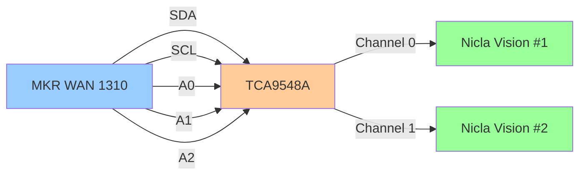

# Hardware Wiring Diagram - IoT Multi-Sensor System

## System Overview

This IoT system combines multiple Arduino boards for comprehensive environmental monitoring and object detection:

```
┌─────────────────────────────────────────────────────────────────┐
│                    POWER SUPPLY (5V 2A)                         │
└────────────────────────┬────────────────────────────────────────┘
                         │
                         ├─── 5V ───┬──> Arduino MKR WAN 1310 (VIN)
                         │          │
                         │          ├──> TCA9548A I2C Multiplexer (VCC)
                         │          │
                         │          ├──> Nicla Vision #1 (VIN)
                         │          │
                         │          ├──> Nicla Vision #2 (VIN)
                         │          │
                         │          └──> Nicla Sense Me (VIN)
                         │
                         └─── GND ──┬──> Arduino MKR WAN 1310 (GND)
                                    │
                                    ├──> TCA9548A I2C Multiplexer (GND)
                                    │
                                    ├──> Nicla Vision #1 (GND)
                                    │
                                    ├──> Nicla Vision #2 (GND)
                                    │
                                    └──> Nicla Sense Me (GND)
```

## I2C Bus Architecture

The I2C multiplexer (TCA9548A) allows dual Nicla Vision cameras to share the same I2C bus:

```
┌─────────────────────────────────────────────────────────────────┐
│                   Arduino MKR WAN 1310                           │
│                                                                   │
│  Pin 11 (SDA) ─────┬──────> TCA9548A SCA                         │
│  Pin 12 (SCL) ─────┼──────> TCA9548A SCL                         │
│                    │                                              │
│  Serial1 RX <──────┴──────> Nicla Sense Me TX                    │
│  Serial1 TX ──────────────> Nicla Sense Me RX                    │
│                    │                                              │
│  Serial2 RX <─────────────> TCA9548A Channel 0                   │
│                    │                                              │
│  Serial2 TX ──────────────> TCA9548A Channel 1                   │
└────────────────────┼────────────────────────────────────────────┘
                     │
         ┌───────────┴───────────┐
         │                       │
    ┌────▼────┐             ┌────▼────┐
    │ Channel │             │ Channel │
    │    0    │             │    1    │
    └────┬────┘             └────┬────┘
         │                       │
    ┌────▼────┐             ┌────▼────┐
    │ Nicla   │             │ Nicla   │
    │ Vision  │             │ Vision  │
    │  #1     │             │  #2     │
    │ SDA/SCL │             │ SDA/SCL │
    └─────────┘             └─────────┘
```

## Detailed Connection Diagram

```mermaid
graph TB
    Power[5V 2A Power Supply] --> MKR_VIN[Arduino MKR WAN 1310 VIN]
    Power --> TCA_VCC[TCA9548A VCC]
    Power --> NV1_VIN[Nicla Vision #1 VIN]
    Power --> NV2_VIN[Nicla Vision #2 VIN]
    Power --> NS_VIN[Nicla Sense Me VIN]

    Power_GND[Power Supply GND] --> MKR_GND[Arduino MKR WAN 1310 GND]
    Power_GND --> TCA_GND[TCA9548A GND]
    Power_GND --> NV1_GND[Nicla Vision #1 GND]
    Power_GND --> NV2_GND[Nicla Vision #2 GND]
    Power_GND --> NS_GND[Nicla Sense Me GND]

    MKR_SDA[MKR WAN 1310 Pin 11 SDA] --> TCA_SDA[TCA9548A SDA]
    MKR_SCL[MKR WAN 1310 Pin 12 SCL] --> TCA_SCL[TCA9548A SCL]

    TCA_C0[TCA9548A Channel 0] --> NV1_I2C[Nicla Vision #1 I2C]
    TCA_C1[TCA9548A Channel 1] --> NV2_I2C[Nicla Vision #2 I2C]

    MKR_RX1[MKR WAN 1310 Serial1 RX] --> NS_TX[Nicla Sense Me TX]
    MKR_TX1[MKR WAN 1310 Serial1 TX] --> NS_RX[Nicla Sense Me RX]

    style Power fill:#ff9999
    style MKR_VIN fill:#99ccff
    style TCA_VCC fill:#99ff99
```



## I2C Multiplexer Control Pins



## Pin Configuration Table

### Arduino MKR WAN 1310

| Pin | Connection | Description |
|-----|------------|-------------|
| VIN | 5V Power | Main power input |
| GND | GND | Common ground |
| 11 (SDA) | TCA9548A SDA | I2C Data |
| 12 (SCL) | TCA9548A SCL | I2C Clock |
| TX1 | Nicla Sense Me RX | Serial data to sensor |
| RX1 | Nicla Sense Me TX | Serial data from sensor |
| 13 (SCK) | LoRaWAN Module | SPI Clock |
| 10 (MOSI) | LoRaWAN Module | SPI MOSI |
| 9 (MISO) | LoRaWAN Module | SPI MISO |
| 8 (CS) | LoRaWAN Module | SPI Chip Select |

### TCA9548A I2C Multiplexer

| Pin | Connection | Description |
|-----|------------|-------------|
| VCC | 5V Power | Power supply |
| GND | GND | Ground |
| SDA | MKR SDA (Pin 11) | I2C Data |
| SCL | MKR SCL (Pin 12) | I2C Clock |
| A0 | GND | Address bit 0 |
| A1 | GND | Address bit 1 |
| A2 | GND | Address bit 2 |
| SC0/SD0 | Nicla Vision #1 | Channel 0 I2C |
| SC1/SD1 | Nicla Vision #2 | Channel 1 I2C |

### Nicla Vision Boards (x2)

| Pin | Connection | Description |
|-----|------------|-------------|
| VIN | 5V Power | Power supply |
| GND | GND | Ground |
| SDA | TCA9548A Channel | I2C Data |
| SCL | TCA9548A Channel | I2C Clock |

### Nicla Sense Me

| Pin | Connection | Description |
|-----|------------|-------------|
| VIN | 5V Power | Power supply |
| GND | GND | Ground |
| TX | MKR RX1 | Serial data out |
| RX | MKR TX1 | Serial data in |

## Power Distribution

### Power Budget Calculation

| Component | Operating Voltage | Current (typical) | Current (peak) |
|-----------|-------------------|-------------------|----------------|
| MKR WAN 1310 | 5V | 30mA | 150mA |
| Nicla Vision #1 | 5V | 150mA | 250mA |
| Nicla Vision #2 | 5V | 150mA | 250mA |
| Nicla Sense Me | 5V | 20mA | 50mA |
| TCA9548A | 5V | 5mA | 10mA |
| **Total** | | **355mA** | **710mA** |

**Recommendation**: 5V 2A power supply provides ~3x safety margin

### Power Consumption Phases

**Normal Operation**: ~355mA continuous
**Peak (both cameras active)**: ~710mA
**LoRaWAN Transmission**: +150mA burst
**WiFi Transmission**: +200mA burst

## Grounding Considerations

**IMPORTANT**: All GND connections must be connected to a common ground:
- Power supply GND
- MKR WAN 1310 GND
- Both Nicla Vision GND
- Nicla Sense Me GND
- TCA9548A GND

This prevents ground loops and ensures reliable I2C communication.

## I2C Address Configuration

| Device | I2C Address | Multiplexer Channel |
|--------|-------------|---------------------|
| TCA9548A | 0x70 (default) | N/A |
| Nicla Vision #1 | N/A | Channel 0 |
| Nicla Vision #2 | N/A | Channel 1 |
| Nicla Sense Me | N/A | Direct I2C (no multiplexer) |

## Signal Integrity Recommendations

1. **I2C Pull-up Resistors**: 4.7kΩ on SDA and SCL lines
2. **Maximum I2C Bus Length**: < 1 meter for reliable operation
3. **Cable Type**: Shielded twisted pair for I2C connections
4. **Decoupling Capacitors**: 100nF ceramic capacitors near each device's power pins

## Wiring Checklist

- [ ] All VIN pins connected to 5V
- [ ] All GND pins connected to common ground
- [ ] I2C multiplexer A0, A1, A2 connected to GND (address 0x70)
- [ ] Nicla Vision #1 connected to TCA9548A Channel 0
- [ ] Nicla Vision #2 connected to TCA9548A Channel 1
- [ ] Nicla Sense Me TX/RX connected to MKR Serial1
- [ ] LoRaWAN antenna connected to MKR WAN 1310
- [ ] WiFi antenna connected to MKR WAN 1310
- [ ] Power supply capable of 2A output
- [ ] All connections secured and insulated
