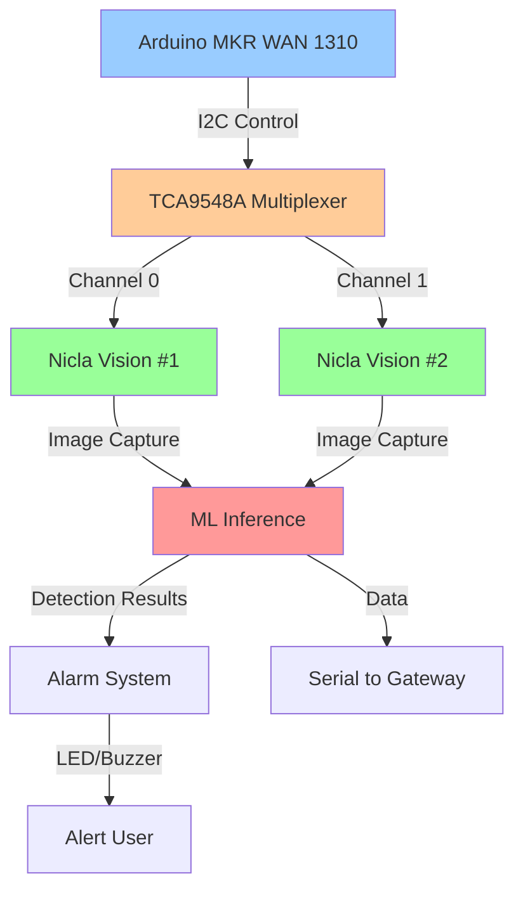

# Dual Camera Object Detection System

## Overview

The dual camera object detection system uses two Arduino Nicla Vision boards with I2C multiplexing to perform simultaneous visual monitoring and object detection using TinyML models.

## System Architecture



## Components

### Hardware

| Component | Quantity | Purpose |
|-----------|----------|---------|
| Arduino Nicla Vision | 2 | Camera + ML processing |
| TCA9548A I2C Multiplexer | 1 | Dual camera control |
| LED (Red) | 1 | Alarm indicator |
| Buzzer | 1 | Audio alert |

### Software

- TensorFlow Lite for Microcontrollers
- Arduino_OV5640 camera library
- Wire library (I2C communication)
- Custom ML model for object detection

## Camera Configuration

### Image Settings

```cpp
Resolution: 320x240 (QVGA)
Format: RGB565
Frame Rate: 30fps
Buffer Size: 320 * 240 * 2 = 153,600 bytes
```

### Model Input Settings

```cpp
Input Size: 96x96x3 (RGB)
Model Type: Quantized uint8
Inference Time: ~100-200ms
RAM Usage: ~500KB
```

## I2C Multiplexer Control

### Channel Switching

```cpp
// Switch to Camera 1
switchToCamera(CAMERA_1_ID);

// Capture image from Camera 1
captureImage(CAMERA_1_ID, frameBuffer1);

// Switch to Camera 2
switchToCamera(CAMERA_2_ID);

// Capture image from Camera 2
captureImage(CAMERA_2_ID, frameBuffer2);
```

### Timing Considerations

```
Total cycle time:
- Switch I2C channel: ~10ms
- Capture image: ~33ms (30fps)
- Resize image: ~20ms
- Run inference: ~100-200ms
- Process results: ~5ms

Total per camera: ~168-268ms
Total for both cameras: ~336-536ms (excluding overlap)
```

## TinyML Model

### Model Architecture

```
Input: 96x96x3 RGB image
├── Conv2D (32 filters, 3x3) + ReLU + MaxPool
├── Conv2D (64 filters, 3x3) + ReLU + MaxPool
├── Conv2D (64 filters, 3x3) + ReLU + MaxPool
├── Flatten
├── Dense (128 units) + ReLU + Dropout
└── Dense (3 units) + Softmax

Output: 3 classes (Person, Vehicle, Animal)
```

### Training the Model

#### Data Collection

```python
# Collect training data
classes = ['person', 'vehicle', 'animal']
images_per_class = 1000
image_size = (96, 96)

# Use diverse datasets
# - COCO dataset
# - Open Images dataset
# - Custom captured images
```

#### Model Training (Python)

```python
import tensorflow as tf

# Define model
model = tf.keras.Sequential([
    tf.keras.layers.Conv2D(32, 3, activation='relu', input_shape=(96, 96, 3)),
    tf.keras.layers.MaxPooling2D(),
    tf.keras.layers.Conv2D(64, 3, activation='relu'),
    tf.keras.layers.MaxPooling2D(),
    tf.keras.layers.Conv2D(64, 3, activation='relu'),
    tf.keras.layers.MaxPooling2D(),
    tf.keras.layers.Flatten(),
    tf.keras.layers.Dense(128, activation='relu'),
    tf.keras.layers.Dropout(0.5),
    tf.keras.layers.Dense(3, activation='softmax')
])

# Compile
model.compile(optimizer='adam',
              loss='categorical_crossentropy',
              metrics=['accuracy'])

# Train
model.fit(train_dataset, epochs=50, validation_data=val_dataset)
```

#### Model Conversion

```python
# Convert to TensorFlow Lite
converter = tf.lite.TFLiteConverter.from_keras_model(model)

# Optimize for microcontrollers
converter.optimizations = [tf.lite.Optimize.DEFAULT]
converter.target_spec.supported_types = [tf.float32]

# Convert
tflite_model = converter.convert()

# Save to file
with open('model.tflite', 'wb') as f:
    f.write(tflite_model)

# Convert to C array
!xxd -i model.tflite > model_data.cc
```

### Model Integration

```cpp
// Include model in sketch
#include "model_data.cc"

// Load model in code
model = tflite::GetModel(g_model);
```

## Detection Algorithm

### Process Flow

```
1. Switch to Camera 1
2. Capture image (320x240 RGB565)
3. Resize to model input (96x96 RGB888)
4. Convert RGB565 to RGB888
5. Run inference
6. Check detection threshold
7. If valid detection:
   - Update statistics
   - Check alarm conditions
   - Trigger alarm if needed
8. Switch to Camera 2
9. Repeat steps 2-8
```

### Threshold Configuration

```cpp
#define DETECTION_THRESHOLD 0.5f   // 50% confidence minimum
#define CONFIDENCE_THRESHOLD 0.6f  // 60% for alarm trigger
```

**Why two thresholds?**

- `DETECTION_THRESHOLD`: Minimum confidence to consider a detection valid
- `CONFIDENCE_THRESHOLD`: Higher threshold for triggering alarms (reduces false positives)

### Alarm Logic

```cpp
bool shouldTriggerAlarm(const DetectionResult& result) {
  // Trigger alarm for high-confidence person detection
  if (result.classId == CLASS_PERSON &&
      result.confidence >= CONFIDENCE_THRESHOLD) {
    return true;
  }

  // Add other conditions:
  // - Vehicle detection (for traffic monitoring)
  // - Animal detection (for wildlife monitoring)
  // - Multiple detections (for crowd detection)

  return false;
}
```

## Alarm System

### Hardware Setup

```cpp
#define ALARM_LED_PIN LED_BUILTIN
#define ALARM_BUZZER_PIN 2

// Setup
pinMode(ALARM_LED_PIN, OUTPUT);
pinMode(ALARM_BUZZER_PIN, OUTPUT);
```

### Alarm Behavior

```
Trigger Conditions:
- Person detected with >60% confidence
- Configurable for other use cases

Alarm Duration: 5 seconds
Indicators:
- Visual: LED blinks
- Audio: Buzzer sounds
- Serial: Log message
```

### Alarm States

```cpp
// States
bool alarmActive = false;
unsigned long alarmStartTime = 0;

// Trigger alarm
void triggerAlarm() {
  alarmActive = true;
  alarmStartTime = millis();
  digitalWrite(ALARM_LED_PIN, HIGH);
  digitalWrite(ALARM_BUZZER_PIN, HIGH);
}

// Update alarm (call in loop)
void updateAlarm() {
  if (alarmActive && millis() - alarmStartTime >= ALARM_DURATION_MS) {
    alarmActive = false;
    digitalWrite(ALARM_LED_PIN, LOW);
    digitalWrite(ALARM_BUZZER_PIN, LOW);
  }
}
```

## Data Transmission

### Serial Format

Detection results are transmitted via Serial to the gateway:

```
Format: DET:camera_id,class_id,confidence,timestamp

Example: DET:0,0,85,1234567890
         │ │ │ │  │
         │ │ │ │  └─ Unix timestamp
         │ │ │ └───── Confidence percentage (85%)
         │ │ └─────── Class ID (0 = Person)
         │ └───────── Camera ID (0 or 1)
         └─────────── Message type (DETECTION)
```

### JSON Format (for WiFi transmission)

```json
{
  "camera_id": 0,
  "class": "Person",
  "confidence": 0.85,
  "timestamp": 1234567890,
  "bounding_box": {
    "x": 100,
    "y": 50,
    "width": 120,
    "height": 180
  }
}
```

## Performance Optimization

### Memory Management

```cpp
// Use static buffers (avoid heap allocation)
uint8_t frameBuffer1[FRAME_BUFFER_SIZE];
uint8_t frameBuffer2[FRAME_BUFFER_SIZE];

// Reuse tensor arena
constexpr int kTensorArenaSize = 500 * 1024;
uint8_t tensor_arena[kTensorArenaSize];

// Avoid String class (use char arrays)
char message[128];
snprintf(message, sizeof(message), "Detection: %s", className);
```

### Processing Optimization

```cpp
// Capture and process alternately (don't block)
// Option 1: Sequential
processCamera1();
processCamera2();

// Option 2: Interleaved (better responsiveness)
if (millis() - lastCapture1 >= captureInterval) {
  captureAsync(CAMERA_1);
}
if (millis() - lastCapture2 >= captureInterval) {
  captureAsync(CAMERA_2);
}
```

### Inference Optimization

```cpp
// Use quantized models (int8 instead of float)
// Reduces inference time by ~50%
converter.optimizations = [tf.lite.Optimize.DEFAULT]
converter.target_spec.supported_types = [tf.int8]

// Enable caching (if supported)
interpreter->SetBuffer(-1, -1, tensor_arena, kTensorArenaSize);
```

## Troubleshooting

### Camera Not Detected

```
Problem: I2C scanner doesn't find camera

Solutions:
1. Check TCA9548A wiring (SDA, SCL, VCC, GND)
2. Verify TCA9548A address (0x70)
3. Test camera on direct I2C (bypass multiplexer)
4. Check camera power (5V)
5. Try different I2C speed (100kHz vs 400kHz)
```

### Low Detection Accuracy

```
Problem: Many false positives or missed detections

Solutions:
1. Improve training data (more diverse images)
2. Adjust detection thresholds
3. Improve lighting conditions
4. Clean camera lens
5. Check image quality (focus, exposure)
```

### Out of Memory

```
Problem: "Failed to allocate tensors" error

Solutions:
1. Reduce tensor arena size
2. Use smaller model (fewer layers/filters)
3. Reduce image resolution
4. Disable unused features
5. Use external PSRAM (if available)
```

### Slow Inference

```
Problem: Inference takes >500ms

Solutions:
1. Use quantized model (int8)
2. Reduce input size (96x96 → 64x64)
3. Simplify model (fewer layers)
4. Enable hardware acceleration (Ethos-U55)
5. Optimize image preprocessing
```

## Best Practices

1. **Always test I2C connections** before integrating cameras
2. **Use consistent lighting** for better detection accuracy
3. **Calibrate detection thresholds** for your environment
4. **Monitor memory usage** to prevent crashes
5. **Log detection statistics** to track performance
6. **Update model regularly** with new training data
7. **Test alarm system** before deployment
8. **Use error handling** for camera failures
9. **Optimize inference time** for responsive operation
10. **Document model version** for reproducibility

## Integration with Main System

See `src/firmware/mkr_wan_gateway.ino` for integration examples.

The vision system sends detection results via Serial to the gateway, which then transmits them via LoRaWAN or WiFi to the backend server.

## Future Enhancements

- [ ] Implement tracking (track objects across frames)
- [ ] Add more detection classes
- [ ] Use stereo vision for depth estimation
- [ ] Implement face recognition
- [ ] Add video recording capability
- [ ] Use more advanced models (YOLO, SSD)
- [ ] Implement edge impulse models
- [ ] Add OTA model updates
- [ ] Implement adaptive frame rate based on activity
