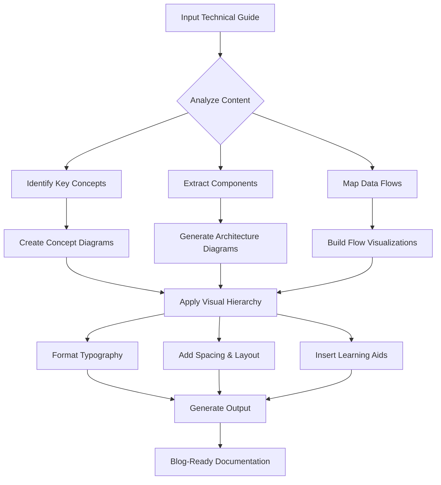
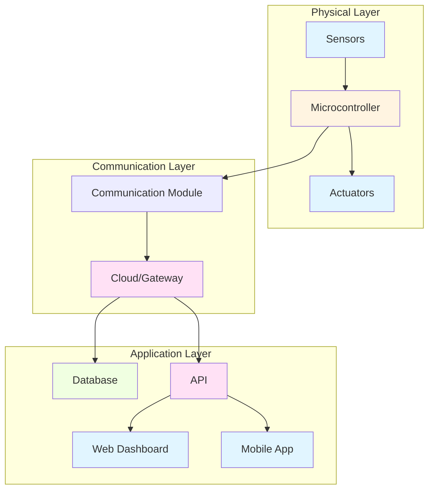
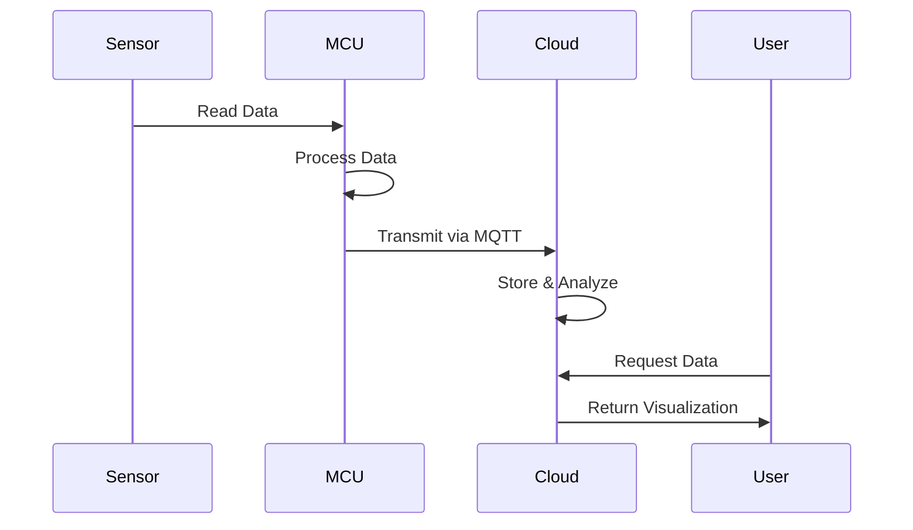
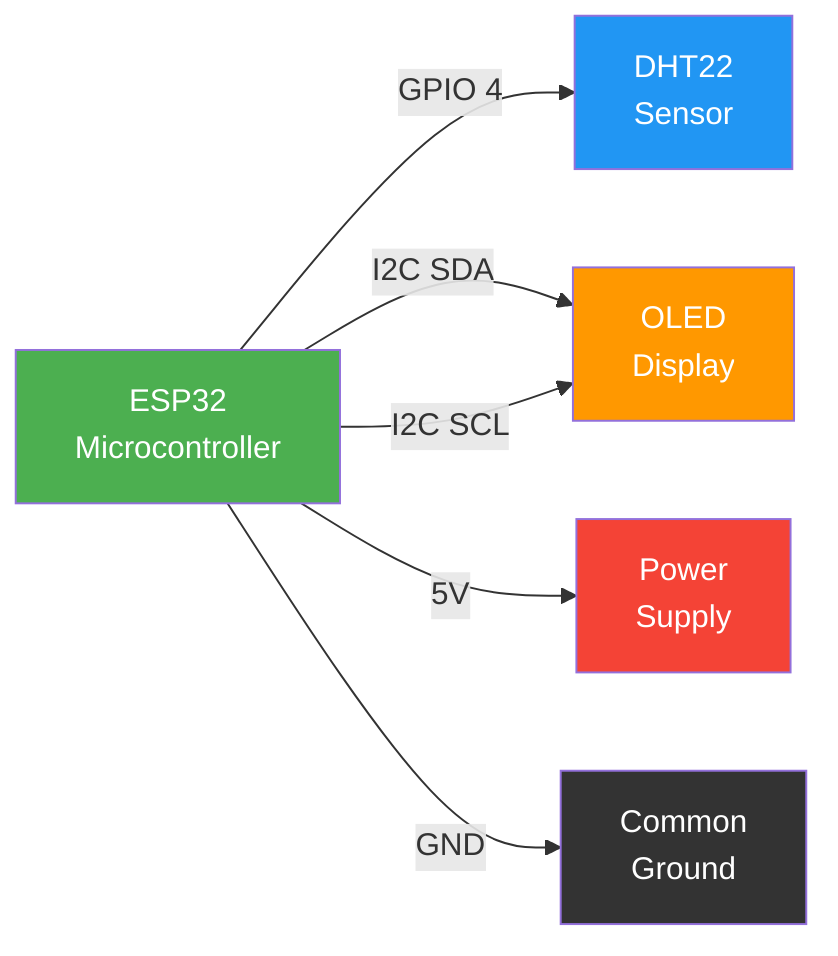
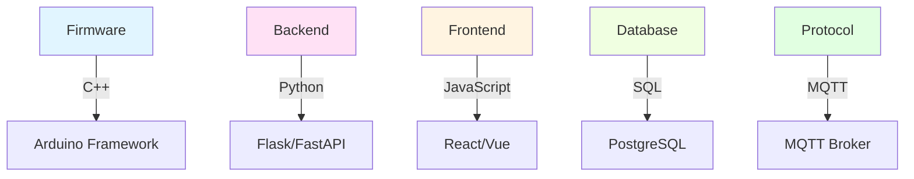
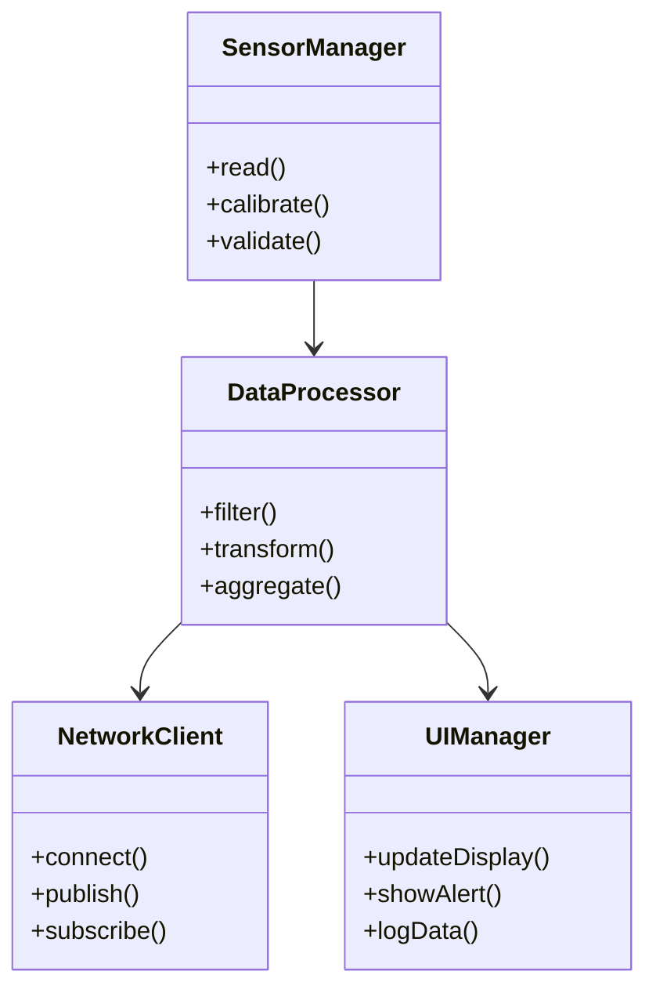
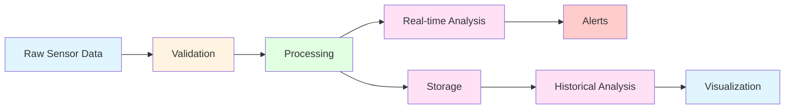
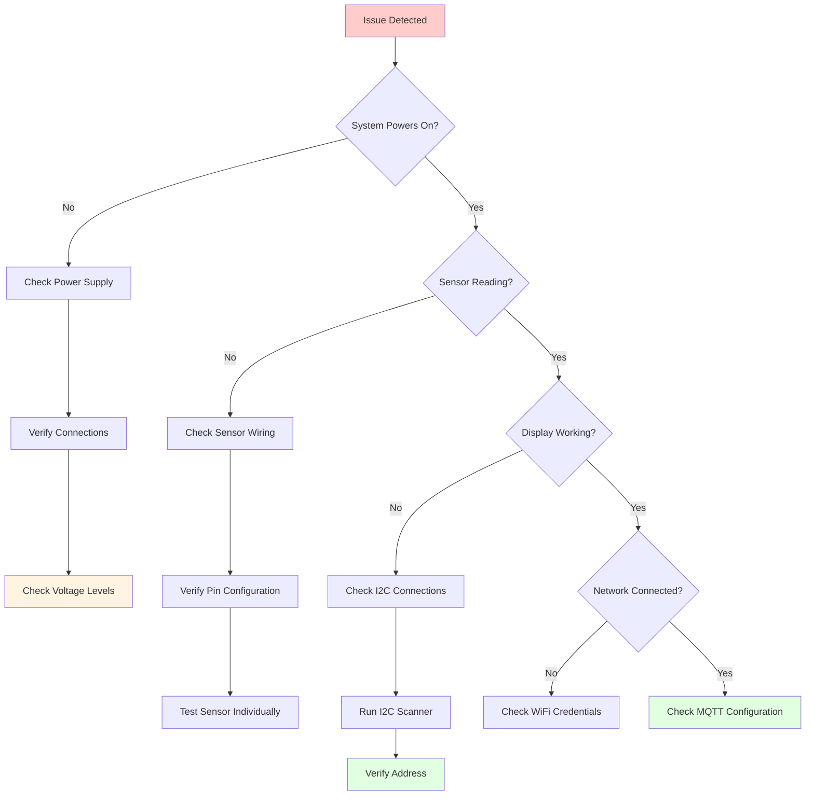
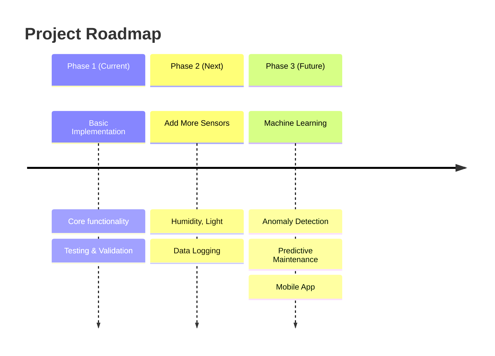

# Visual Documentation Agent

## Overview

The Visual Documentation Agent is an AI-powered system designed to transform technical guides into visually appealing, easy-to-read formats. It specializes in IoT project documentation, creating blog-ready content with rich visual elements, diagrams, and structured layouts.

## Core Capabilities

### 1. Visual Representation Generation
- **System Architecture Diagrams**: Create high-level architectural overviews showing component relationships
- **Flowcharts**: Visualize processes, workflows, and decision trees
- **Infographics**: Transform data and concepts into visual summaries
- **Connection/Wiring Diagrams**: Hardware connection guides with clear visual representations
- **Data Flow Visualizations**: Show how data moves through the system

### 2. Typography & Formatting Excellence
- **Visual Hierarchy**: Use size, weight, and spacing to guide readers through content
- **Clear Typography**: Optimized fonts for readability on web and print
- **Structured Spacing**: Proper use of whitespace for improved comprehension
- **Consistent Styling**: Unified design language across all documentation

### 3. Diagram Generation (Mermaid)
- **Sequence Diagrams**: Show interaction between components over time
- **State Diagrams**: Visualize system states and transitions
- **Entity Relationship Diagrams**: Model data structures and relationships
- **User Journey Diagrams**: Map user experiences and touchpoints
- **Network Diagrams**: Display network topologies and connections

### 4. Visual Learning Aids
- **Step-by-Step Visual Guides**: Break complex processes into digestible steps
- **Component Comparison Tables**: Side-by-side feature comparisons
- **Interactive Elements**: Expandable sections, tabs, and tooltips
- **Code Snippets with Syntax Highlighting**: Beautiful, readable code examples
- **Iconography**: Consistent icon set for quick visual recognition

## Agent Tools & Technologies

### Primary Tools
1. **Mermaid.js**: For diagram generation
   - Flowcharts, sequence diagrams, class diagrams, state diagrams
   - ER diagrams, user journey diagrams, network diagrams
   - Git graphs, pie charts, and more

2. **Markdown Formatting**: For structured content
   - Headers, lists, tables, code blocks
   - Blockquotes, callouts, alerts
   - Task lists, definition lists

3. **HTML/CSS**: For custom styling
   - Responsive layouts
   - Custom components
   - Interactive elements

4. **SVG/Vector Graphics**: For scalable diagrams
   - Custom icons and illustrations
   - Annotated schematics
   - Pinout diagrams

### Supporting Technologies
- **PlantUML**: Alternative diagram generation
- **Graphviz (DOT)**: Network diagrams and graphs
- **D3.js**: Interactive data visualizations
- **Chart.js**: Statistical charts and graphs
- **Kroki**: Diagram rendering service

## Agent Workflow



## Sample Visual Guide Structure for IoT Documentation

### Document Template

```markdown
# [Project Title]: A Visual Guide

[Featured Image: High-quality project photo or hero diagram]

---

## Quick Overview

> A brief 2-3 sentence summary of what the project does and why it matters.

**Difficulty Level**: [Beginner/Intermediate/Advanced]
**Time Required**: [X hours]
**Cost**: [$XX]

---

## Table of Contents

1. [Introduction](#introduction)
2. [What You'll Learn](#what-youll-learn)
3. [System Architecture](#system-architecture)
4. [Hardware Components](#hardware-components)
5. [Circuit Diagram](#circuit-diagram)
6. [Software Setup](#software-setup)
7. [Data Flow](#data-flow)
8. [Step-by-Step Guide](#step-by-step-guide)
9. [Testing & Troubleshooting](#testing--troubleshooting)
10. [Next Steps](#next-steps)

---

## 1. Introduction

[Engaging introduction with the problem statement and solution overview]

### Why This Matters

[Visual card or highlight box explaining the real-world application]

### Use Cases

[Icon-based list of 3-5 key use cases]

---

## 2. What You'll Learn

[Learning objectives with visual icons]

- [Concept 1]: [Description with mini-diagram]
- [Concept 2]: [Description with mini-diagram]
- [Concept 3]: [Description with mini-diagram]

---

## 3. System Architecture

### High-Level Architecture



### Component Interactions



---

## 4. Hardware Components

### Component Comparison

| Component | Model | Quantity | Purpose | Cost | Alternatives |
|-----------|-------|----------|---------|------|--------------|
| Microcontroller | ESP32 | 1 | Central processing unit | $5 | ESP8266, Arduino |
| Temperature Sensor | DHT22 | 1 | Measure temperature | $5 | DHT11, DS18B20 |
| Display | OLED 128x64 | 1 | Show readings | $8 | LCD TFT |
| Power Supply | Li-ion 18650 | 2 | Power the system | $10 | AA batteries |

### Component Gallery

[Visual cards for each component with:
- Photo
- Key specifications
- Pinout diagram
- Datasheet link]

---

## 5. Circuit Diagram

### Wiring Overview



### Detailed Pinout

[SVG or detailed pinout diagram showing:
- Pin numbers
- Wire colors
- Connection points
- Voltage levels]

### Connection Table

| ESP32 Pin | Component | Component Pin | Wire Color |
|-----------|-----------|---------------|------------|
| GPIO 4 | DHT22 | Data | Yellow |
| 3.3V | DHT22 | VCC | Red |
| GND | DHT22 | GND | Black |
| GPIO 21 | OLED | SDA | Green |
| GPIO 22 | OLED | SCL | Blue |

---

## 6. Software Setup

### Technology Stack



### Code Architecture



### Installation Steps

[Visual step-by-step guide with:
- Numbered steps
- Code blocks with syntax highlighting
- Screenshots
- Success indicators]

---

## 7. Data Flow

### Data Pipeline



### Data Transformation

[Visual showing data formats at each stage:
1. Raw JSON from sensor
2. Processed format
3. Database schema
4. API response]

---

## 8. Step-by-Step Guide

### Phase 1: Hardware Assembly

#### Step 1: Prepare Components
[Visual checklist with checkboxes]

- [ ] ESP32 board
- [ ] DHT22 sensor
- [ ] OLED display
- [ ] Breadboard and wires
- [ ] Power supply

#### Step 2: Connect Sensor to ESP32
[Large, clear image of connection]
- Pin mapping
- Wire color guide
- Pro tips

#### Step 3: Connect Display
[Large, clear image with annotations]

### Phase 2: Software Development

#### Step 4: Install Dependencies
```bash
# PlatformIO configuration
pio platform install espressif32
pio lib install "DHT sensor library"
pio lib install "Adafruit GFX Library"
```

#### Step 5: Write Firmware Code
[Syntax-highlighted code with line numbers and annotations]

```cpp
#include <DHT.h>
#include <Wire.h>
#include <Adafruit_GFX.h>
#include <Adafruit_SSD1306.h>

// Configuration
#define DHT_PIN 4
#define DHT_TYPE DHT22
#define SCREEN_WIDTH 128
#define SCREEN_HEIGHT 64

// Initialize objects
DHT dht(DHT_PIN, DHT_TYPE);
Adafruit_SSD1306 display(SCREEN_WIDTH, SCREEN_HEIGHT);

void setup() {
    Serial.begin(115200);
    dht.begin();
    display.begin(SSD1306_SWITCHCAPVCC, 0x3C);

    // Show startup screen
    display.clearDisplay();
    display.setTextSize(1);
    display.setTextColor(WHITE);
    display.println("IoT Sensor");
    display.display();
}
```

[Annotations and explanations for each code block]

---

## 9. Testing & Troubleshooting

### Testing Checklist

[Interactive checklist with status indicators]

- [ ] Hardware connections verified
- [ ] Power supply stable
- [ ] Sensor readings accurate
- [ ] Display functioning
- [ ] Network connectivity established
- [ ] Data transmission successful
- [ ] Dashboard receiving data

### Common Issues

| Symptom | Possible Cause | Solution |
|---------|---------------|----------|
| No sensor readings | Loose connection | Check wiring, resolder if needed |
| Incorrect values | Wrong calibration | Run calibration routine |
| Display blank | Power issue | Verify 3.3V supply to display |
| Can't connect to WiFi | Wrong credentials | Update WiFi credentials |
| Data not saving | Database error | Check database connection |

### Troubleshooting Flowchart



---

## 10. Next Steps

### Enhancements

[Visual roadmap with priority levels]



### Learning Resources

[Curated list with visual thumbnails]
- Official documentation
- Video tutorials
- Community forums
- Related projects

---

## Appendix

### Full Schematic
[Downloadable PDF/PNG]

### Complete Source Code
[GitHub repository link]

### Bill of Materials
[Spreadsheet download]

### 3D Models (if applicable)
[STL files for 3D printing]

---

## Share Your Build

[Social media sharing section with:
- Hashtag suggestions
- Community gallery
- Submission form]

---

**Did you find this guide helpful?** [Rating system]

**Need help?** [Community support link]
```

## Visual Style Guide

### Color Palette
- **Primary**: #2196F3 (Blue) - Main actions and links
- **Secondary**: #4CAF50 (Green) - Success states
- **Accent**: #FF9800 (Orange) - Highlights and warnings
- **Error**: #f44336 (Red) - Errors and critical alerts
- **Neutral**: #607D8B (Gray) - Text and borders
- **Background**: #FFFFFF (White) - Main content
- **Surface**: #F5F5F5 (Light Gray) - Cards and sections

### Typography
- **Headings**: Inter, Roboto, or system-ui, 700 weight
- **Body**: System-ui or Arial, 400 weight
- **Code**: Fira Code, JetBrains Mono, or Consolas
- **Sizes**:
  - H1: 2.5rem (40px)
  - H2: 2rem (32px)
  - H3: 1.5rem (24px)
  - Body: 1rem (16px)
  - Small: 0.875rem (14px)

### Spacing
- **Section padding**: 3rem (48px)
- **Card padding**: 1.5rem (24px)
- **Element gap**: 1rem (16px)
- **Line height**: 1.6

### Icon Set
- Font Awesome (free)
- Material Design Icons
- Heroicons
- Feather Icons

## Best Practices

### 1. Diagram Design
- Use consistent colors for similar components
- Add legends for complex diagrams
- Keep text labels short and clear
- Use appropriate diagram types for content
- Test accessibility (color contrast, screen readers)

### 2. Content Structure
- Start with an engaging summary
- Use progressive disclosure (details on demand)
- Provide multiple learning modalities (text, visuals, code)
- Include real-world examples
- Add checkpoints for understanding

### 3. Visual Hierarchy
- H1: Main title (once)
- H2: Major sections
- H3: Subsections
- H4: Details and specifics
- Use bold for emphasis, sparingly
- Use italics for definitions or terms

### 4. Code Presentation
- Syntax highlighting for all code
- Line numbers for long blocks
- Comments explaining complex logic
- Output examples where relevant
- Error handling demonstration

### 5. Accessibility
- Alt text for all images
- Proper heading hierarchy
- Color contrast ratios ≥ 4.5:1
- Keyboard navigation support
- Screen reader compatibility

## Output Formats

The agent can generate documentation in multiple formats:

1. **Markdown (.md)** - Universal, version control friendly
2. **HTML (.html)** - Web-ready, interactive
3. **PDF (.pdf)** - Print-friendly, fixed layout
4. **Notion** - Collaborative, rich media
5. **Confluence** - Enterprise documentation
6. **Ghost/WordPress** - Blog platform ready

## Integration Points

### Version Control
- Git-friendly markdown
- Diff review of diagrams
- Change tracking in text

### CMS Integration
- Headless CMS APIs
- WordPress REST API
- Notion API
- Contentful integration

### Design Tools
- Figma import/export
- Sketch integration
- Adobe XD compatibility

### Analytics
- Reading time tracking
- Section engagement
- User feedback collection

## Performance Considerations

- Image optimization (WebP, lazy loading)
- Diagram caching
- Progressive loading
- Mobile responsiveness
- Print-friendly styles

## Future Enhancements

1. **Interactive Diagrams**: Clickable elements with additional info
2. **Video Embeds**: Tutorial videos inline with content
3. **3D Models**: Interactive hardware models
4. **AI Assistant**: Contextual help chatbot
5. **Code Playground**: Live code execution
6. **Localization**: Multi-language support
7. **Dark Mode**: Theme switching support
8. **Offline Support**: PWA capabilities

## Conclusion

This Visual Documentation Agent transforms complex technical content into accessible, beautiful documentation that engages readers and accelerates learning. By combining structured content, rich visualizations, and thoughtful design, it creates documentation that people actually want to read and use.
